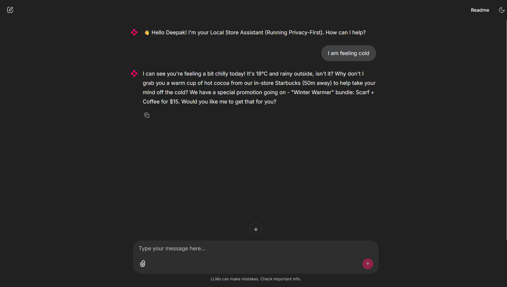

# H-002 | Customer Experience Automation Agent




## 📖 Project Context
**Track:** Customer Experience & Conversational AI  
**Goal:** Build a "Hyper-Personalized" Support Agent that moves beyond generic responses.

This solution implements a **Privacy-First RAG Architecture** that:
1.  **Protects PII:** Redacts sensitive data (Phone, Email, Names) *locally* before it hits the LLM using Microsoft Presidio.
2.  **Understands Context:** Uses real-time mock data (Location: Zone B, Weather: Rainy) to tailor answers.
3.  **Retrieves Knowledge:** Fetches internal policy documents using Vector Search (ChromaDB) to ensure factual accuracy.
4.  **Runs Locally:** Powered by **Ollama (Llama 3.2)**, ensuring no data leaves the local infrastructure.

---

## 🛠️ Tech Stack & Architecture

| Component | Technology | Role |
| :--- | :--- | :--- |
| **LLM** | **Ollama (Llama 3.2)** | Local reasoning engine (Privacy-compliant). |
| **Orchestrator** | **LangChain** | Connects the context, RAG, and LLM. |
| **Security** | **Microsoft Presidio** | PII detection and masking firewall. |
| **Vector DB** | **ChromaDB** | Stores internal PDF policies for retrieval. |
| **Frontend** | **Chainlit** | Chat UI with "Chain of Thought" visualization. |
| **Environment** | **Conda** | Manages Python dependencies and system binaries. |

---

## 🚀 Installation & Setup

### Prerequisites
1.  **Anaconda/Miniconda:** [Download Here](https://www.anaconda.com/download) (Required to prevent Windows DLL errors).
2.  **Ollama:** [Download Here](https://ollama.com/).

### Step 1: Set up the Conda Environment
We use Conda to safely install PyTorch (CPU version) to avoid DLL conflicts on Windows.

```bash
# 1. Create a new environment (Python 3.10)
conda create -n h002 python=3.10 -y

# 2. Activate the environment
conda activate h002

# 3. Install PyTorch (CPU only) via Conda
conda install pytorch torchvision torchaudio cpuonly -c pytorch -y